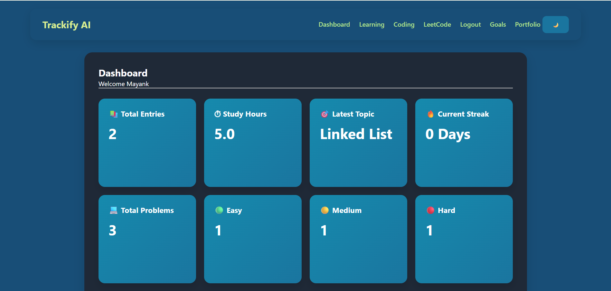
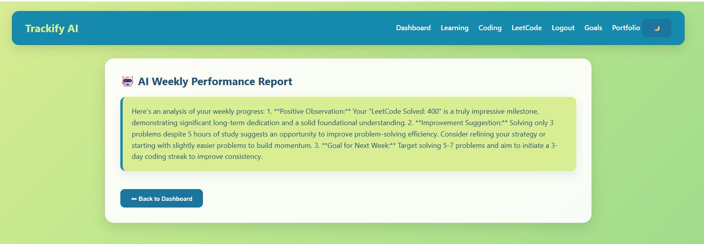
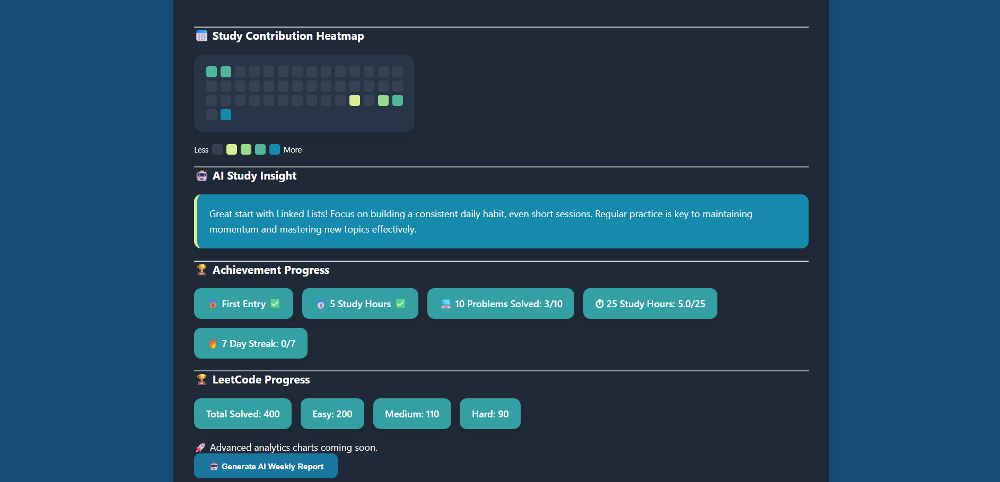
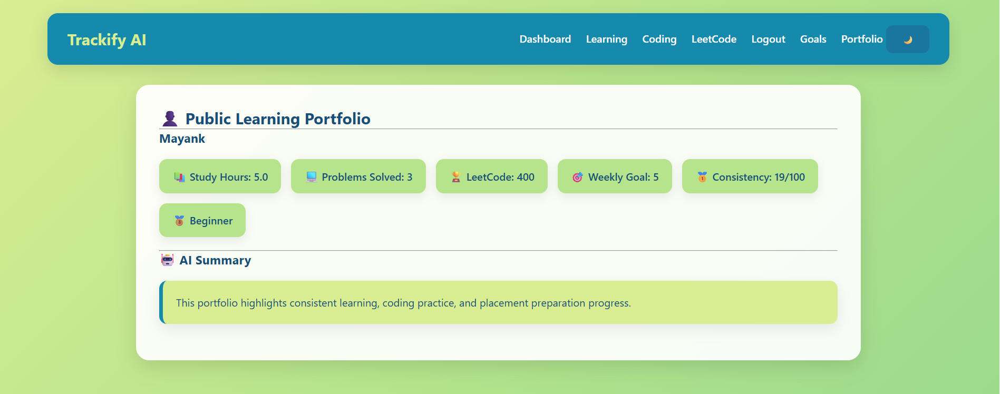

# 🚀 Trackify AI


## 🌟 Overview

Trackify AI is a Flask-based productivity and learning analytics platform that helps students track study sessions, coding progress, goals, achievements, and AI-powered performance insights from a single dashboard.

Trackify AI is a Flask-based productivity and learning analytics platform that helps students track study sessions, coding progress, LeetCode statistics, goals, achievements, and AI-powered performance insights from a single dashboard.

---

## ✨ Features

### 📚 Learning Tracker
- Add and manage study sessions
- Track study hours and topics
- Monitor learning consistency

### 💻 Coding Tracker
- Log coding problems solved
- Track Easy / Medium / Hard problems
- Analyze coding activity trends

### 🏆 LeetCode Integration
- Store and monitor LeetCode progress
- Track total solved, Easy, Medium, and Hard counts

### 🎯 Goal Management
- Set weekly study goals
- Monitor completion percentage
- Unlock achievement alerts on goal completion

### 🤖 AI-Powered Insights
- Personalized study recommendations using Google Gemini AI
- AI-generated weekly performance reports

### 📊 Analytics Dashboard
- Coding difficulty distribution (Pie Chart)
- Weekly study hours analytics (Bar Chart)
- Study contribution heatmap
- Consistency score tracking

### 🥇 Achievement System
- Study milestones
- Goal completion badges
- Learning rank system

### 📄 PDF Reports
- Generate downloadable performance reports
- Includes study, coding, and LeetCode statistics

### 👤 Public Portfolio
- Showcase learning progress publicly
- Display achievements and analytics

---

## 🛠 Tech Stack

- Python
- Flask
- MySQL
- Google Gemini AI
- Chart.js
- HTML5
- CSS3
- JavaScript
- ReportLab
- Git & GitHub

---

## 📸 Screenshots

### Dashboard



### AI Weekly Report



### Study Contribution Heatmap



### Public Learning Portfolio



---

## 📈 Project Statistics

- 18+ Integrated Features
- 15+ Database-driven CRUD Operations
- AI-powered Study Analytics
- Real-time Dashboard Metrics
- Goal Tracking & Achievement System
- Public Learning Portfolio

---

## 🏗️ Project Architecture

```text
User
 │
 ▼
Flask Application
 │
 ├── Authentication
 ├── Learning Tracker
 ├── Coding Tracker
 ├── LeetCode Tracker
 ├── Goal Management
 ├── Analytics Dashboard
 ├── AI Insights (Gemini)
 ├── PDF Reports
 └── Public Portfolio
 │
 ▼
MySQL Database
```

## ⚙️ Installation

### Clone Repository

```bash
git clone https://github.com/yourusername/trackify-ai.git
cd trackify-ai
```

### Create Virtual Environment

```bash
python -m venv venv
```

### Activate Environment

```bash
venv\Scripts\activate
```

### Install Dependencies

```bash
pip install -r requirements.txt
```

### Configure Database

Create MySQL database:

```sql
CREATE DATABASE trackify_ai;
```

Import schema and update database credentials inside:

```python
app.py
```

### Run Application

```bash
python app.py
```

Open:

```text
http://127.0.0.1:5000
```

---

## 🔮 Future Enhancements

- Live LeetCode API Integration
- User Leaderboards
- Email Notifications
- Advanced Analytics
- Cloud Deployment

---

## 👨‍💻 Author

**Mayank Singh Rawat**

B.Tech Information Technology  
JECRC Foundation, Jaipur

GitHub: https://github.com/mayank200529